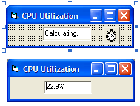

<div align="center">

## CPU Utilization


</div>

### Description

I created this because I needed to be able to adjust how many child processes my batch processing app created so that it didn't I created this demo because I needed to be able to adjust how many child processes my batch processing app created so that it didn't overutilize the CPU.

To duplicate this, create a form with one text box (Text1) and one timer (Timer1) in the configuration you see in the screen shot. Then paste the code seen here.

The main key is the windows idle process (PID = 0), which eats up whatever CPU cycles are not used by other apps. Every so often, this code takes a sample of how much CPU time, in seconds, that process has taken up since it started. Then it takes the delta to calculate its own CPU utilization. Subtract it from 100% and you get the CPU utlization.

In this case, we're using the Windows Management Interface (WMI) to get this information -- mainly because the API calls to get process times won't work for the idle process for security reasons. This should work for Windows 2000 and XP, but probably not for NT 4.0- or Windows 3.x, 9x, or ME.

You can morph this sample a lot of ways. For example, increase the SampleRate variable to get a smoother variation curve over time or decrease to get more immediate values. You can use additional parameters in Locator.ConnectServer() to connect to a remote machine, as another example. See here for more about the WMI objects:

http://msdn.microsoft.com/library/default.asp?url=/library/en-us/wmisdk/wmi/wmi_reference.asp

You could also easily modify this to track some other process' CPU utilization by its PID. Or you could also use it to track memory or other resource utilization.

- Cheers,

Jim Carnicelli
 
### More Info
 


<span>             |<span>
---                |---
**Submitted On**   |
**By**             |[James Vincent Carnicelli](https://github.com/Planet-Source-Code/PSCIndex/blob/master/ByAuthor/james-vincent-carnicelli.md)
**Level**          |Intermediate
**User Rating**    |5.0 (15 globes from 3 users)
**Compatibility**  |VB 6\.0
**Category**       |[Windows System Services](https://github.com/Planet-Source-Code/PSCIndex/blob/master/ByCategory/windows-system-services__1-35.md)
**World**          |[Visual Basic](https://github.com/Planet-Source-Code/PSCIndex/blob/master/ByWorld/visual-basic.md)
**Archive File**   |[](https://github.com/Planet-Source-Code/james-vincent-carnicelli-cpu-utilization__1-50337/archive/master.zip)


### Source Code

```
Option Explicit
'I created this demo because I needed
'to be able to adjust how many child
'processes my batch processing app
'created so that it didn't overutilize
'the CPU.
'
'To duplicate this, create a form with
'one text box (Text1) and one timer
'(Timer1) in the configuration you see
'in the screen shot. Then paste the
'code seen here.
'
'The main key is the windows idle
'process (PID = 0), which eats up
'whatever CPU cycles are not used by
'other apps. Every so often, this code
'takes a sample of how much CPU time, in
'seconds, that process has taken up
'since it started. Then it takes the
'delta to calculate its own CPU
'utilization. Subtract it from 100%
'and you get the CPU utlization.
'
'In this case, we're using the Windows
'Management Interface (WMI) to get this
'information -- mainly because the API
'calls to get process times won't work
'for the idle process for security
'reasons. This should work for Windows
'2000 and XP, but probably not for NT
'4.0- or Windows 3.x, 9x, or ME.
'
'You can morph this sample a lot of
'ways. For example, increase the
'SampleRate variable to get a smoother
'variation curve over time or decrease
'to get more immediate values. You can
'use additional parameters in
'Locator.ConnectServer() to connect to
'a remote machine, as another example.
'See here for more about the WMI
'objects:
'
'  http://msdn.microsoft.com/library/
'   default.asp?url=/library/en-us/
'   wmisdk/wmi/wmi_reference.asp
'
'You could also easily modify this to
'track some other process' CPU
'utilization by its PID. Or you could
'also use it to track memory or other
'resource utilization.
'
'- Cheers,
' Jim Carnicelli
Private Wmi As Object, Locator As Object
Private PrevCpuTime As Long, SampleRate As Long
Private Sub Form_Load()
  SampleRate = 2 'in seconds
  Timer1.Interval = SampleRate * 1000
  Set Locator = CreateObject("WbemScripting.SWbemLocator")
  Set Wmi = Locator.ConnectServer
  Timer1_Timer
End Sub
Private Sub Timer1_Timer()
  Dim Procs As Object, Proc As Object
  Dim CpuTime, Utilization As Single
  Set Procs = Wmi.InstancesOf("Win32_Process")
  For Each Proc In Procs
    If Proc.ProcessID = 0 Then 'System Idle Process
      CpuTime = Proc.KernelModeTime / 10000000
      If PrevCpuTime <> 0 Then
        Utilization = 1 - (CpuTime - PrevCpuTime) / SampleRate
        Text1.Text = Format(Utilization, "0.0%")
      End If
      PrevCpuTime = CpuTime
    End If
  Next
End Sub
```

